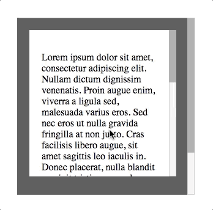
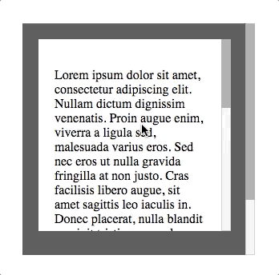

# vue-scroll-stop

A tiny Vue directive that stop propagation scroll when edge reached.
Works with desktop `mousewheel` and mobile `touchmove` events

:white_check_mark: On | :x: Off 
------------- | -------------
  | 

## Sandbox

Want to try? [Here's a link](https://jsfiddle.net/voxtobox/9ghLbek8/).

## Installation

```javascript
npm i --save vue-scroll-stop
```

### Import
In main.js:
```javascript
import Vue from 'vue'
import VueScrollStop from 'vue-scroll-stop'
import App from './App.vue'
 
Vue.use(VueScrollStop)
 
new Vue({
  el: '#app',
  render: h => h(App)
})
```

### Browser

Include the script file, then install the component with `Vue.use(VueScrollStop);` e.g.:

```html
<script type="text/javascript" src="node_modules/vuejs/dist/vue.min.js"></script>
<script type="text/javascript" src="node_modules/vue-scroll-stop/dist/vue-scroll-stop.min.js"></script>
<script type="text/javascript">
  Vue.use(VueScrollStop);
</script>
```

## Usage

Once installed, it can be used in a template as simply:
```html
<div v-scroll-stop></div>
```
By default directive works on both direction but you can strict it by using modifier v (vertical) or h (horizontal) 
```html
<div v-scroll-stop.h></div>  <!-- Works only for horizontal scroll -->
```

You can pass `false` as value to disable directive reactive
```html
<div v-scroll-stop.h="false"></div> <!-- Directive disabled -->
```
